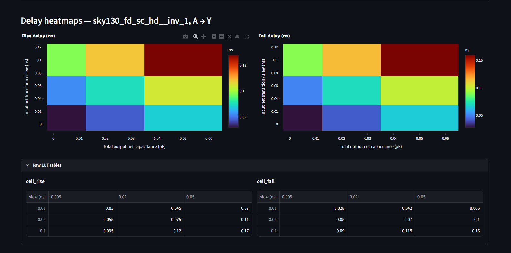
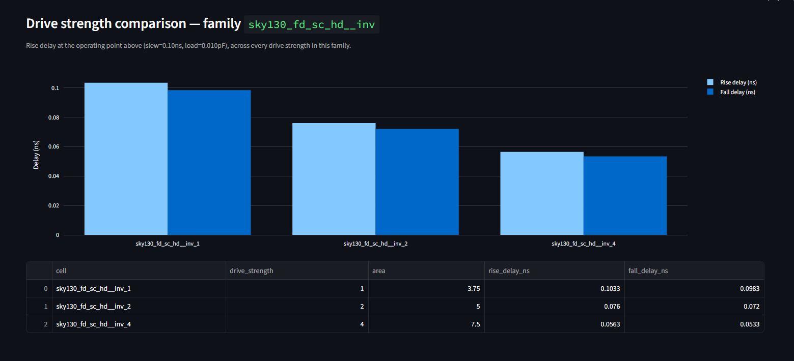

#Liberty File Analyzer & Cell Visualizer

A from-scratch parser and interactive visualizer for **Liberty (`.lib`) timing
files** — the industry-standard format read by PrimeTime, Tempus, and OpenSTA
— originally built against the open-source **Sky130 PDK** and verified across
five different vendor/node Liberty exports.

> ✅ **Verified across 5 real, independently-sourced Liberty libraries:**
> Sky130 (`sky130_fd_sc_hd`), NanGate45/FreePDK45, GF180MCU, Sky130HD
> (a second, differently-characterized Sky130 export), and IHP SG13G2 —
> spanning four different foundries/PDK maintainers (SkyWater/Google,
> Si2/NanGate, GlobalFoundries/Google, IHP) and process nodes from 130nm
> down to 45nm.
>
> Two real cross-vendor Liberty parsing bugs were found and fixed in the
> process (see [Bugs found & fixed](#bugs-found--fixed-across-vendor-libraries)
> below) — not just "it ran once," but debugged against real vendor export
> inconsistencies.

## What this demonstrates

- **Understanding of the Liberty format** — not just using a tool that reads
  `.lib` files, but knowing what's structurally inside them: nested
  `group(args) { attr : value; }` syntax, `lu_table_template` definitions,
  and per-arc `cell_rise` / `cell_fall` / `rise_transition` / `fall_transition`
  lookup tables indexed by input slew and output load.
- **STA fundamentals** — bilinear interpolation over a 2D delay LUT is
  exactly how real timing tools compute delay for slew/load values that
  fall between characterized grid points.
- **Real cross-vendor debugging, not just single-file success** — every
  vendor's Liberty export tool has its own quirks. Getting this working
  cleanly across Sky130, NanGate45, GF180MCU, and IHP SG13G2 required
  finding and fixing two genuine parsing edge cases (below), which is a
  much stronger signal than "parses one sample file."
- **Sky130/standard-cell library conventions** — drive-strength naming
  (`_1`, `_2`, `_4`...), PVT corner naming (`tt_025C_1v80` = typical-typical,
  25°C, 1.8V), and how delay scales with drive strength.
- **End-to-end tool building** — parser → data model → CLI → interactive
  dashboard → CSV export, each layer independently testable, plus a
  standalone debug utility (`debug_cell.py`) for diagnosing any new library
  that doesn't parse cleanly.

## Architecture

```
parser/
├── liberty_parser.py   # Recursive-descent parser for Liberty's grammar.
│                       # No external dependency (no pip liberty-parser) —
│                       # written from first principles: strips comments,
│                       # tracks brace/paren depth and quoted strings,
│                       # classifies each token as a group, a complex
│                       # attribute (e.g. index_1(...);), or a simple
│                       # attribute (name : value;).
└── timing_model.py     # Builds Cell → Pin → TimingArc → LutTable objects
                        # from the raw parse tree, and implements defensive
                        # bilinear interpolation over the slew/load grid
                        # (see bugs found below for why "defensive" matters).
app.py                  # Streamlit dashboard: heatmaps, drive-strength
                        # comparison, CSV export.
cli.py                  # Terminal version — same analysis, scriptable.
debug_cell.py           # Dumps the raw parsed structure of one cell —
                        # the tool used to diagnose both bugs below.
```

## Bugs found & fixed (across vendor libraries)

Real-world Liberty files exposed two genuine parsing edge cases that a
single sample file wouldn't have caught:

**1. Quoted attribute values.** Sky130's real export quotes simple
attributes — `direction : "output";` — not `direction : output;` as most
minimal/tutorial examples show. Every cell in the real file was silently
failing an output-pin check because `'"output"' != "output"`. Fixed by
stripping quotes at the point of use.

**2. Mismatched LUT dimensions.** GF180MCU, Sky130HD, and IHP SG13G2 files
each hit cells where the declared `index_1`/`index_2` breakpoint counts
didn't exactly match the `values()` matrix dimensions — a vendor
export-tool inconsistency, not a spec violation. This crashed bilinear
interpolation with an `IndexError` partway through a CSV export. Fixed by
clamping interpolation indices to the actual per-row matrix bounds, with a
`NaN` fallback for any table too malformed even for that — so one bad cell
degrades gracefully instead of crashing the whole library scan.

## Sample output (real Sky130 data)

```
Cell: sky130_fd_sc_hd__inv_1  |  Rise Delay at (slew=0.1ns, load=0.01pF) = 0.103ns
Cell: sky130_fd_sc_hd__inv_2  |  Rise Delay at (slew=0.1ns, load=0.01pF) = 0.076ns
Cell: sky130_fd_sc_hd__inv_4  |  Rise Delay at (slew=0.1ns, load=0.01pF) = 0.056ns
```

## Dashboard




The Streamlit app lets you upload any Liberty file, pick a cell family,
output pin, and timing arc, then explore:
- **Delay/transition heatmaps** across the full slew × load grid
- **Drive-strength comparison** — auto-grouped cell families (`inv`, `buf`,
  `nand2`, etc.) plotted side by side at any chosen operating point
- **CSV export** of the full parsed summary

## Quick start

```bash
pip install -r requirements.txt
streamlit run app.py          # interactive dashboard
python cli.py <file.lib> --pin Y --related A --slew 0.1 --load 0.01
```

For instructions on downloading real Liberty files (Sky130, NanGate45,
GF180MCU, ASAP7, IHP SG13G2), see [`SETUP.md`](SETUP.md).

## Tested against

| Library | Foundry / Maintainer | Node | Source |
|---|---|---|---|
| `sky130_fd_sc_hd` | SkyWater / Google | 130nm | kunalg123 workshop repo |
| NanGate45 / FreePDK45 | Si2 / NCSU | 45nm | OpenROAD-flow-scripts |
| GF180MCU | GlobalFoundries / Google | 180nm | OpenROAD-flow-scripts |
| Sky130HD | SkyWater (2nd characterization) | 130nm | OpenROAD-flow-scripts |
| IHP SG13G2 | IHP | 130nm SiGe BiCMOS | OpenROAD-flow-scripts |

## Tech stack

Python · Streamlit · Plotly · Pandas — no proprietary EDA tool, no paid
license, fully reproducible with public data.

## License

MIT — see [`LICENSE`](LICENSE).
